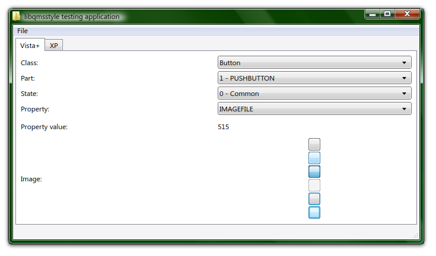
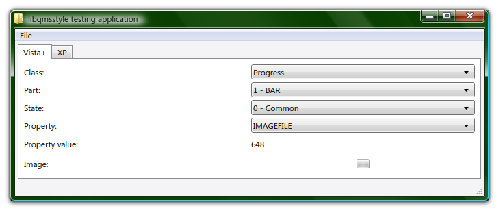
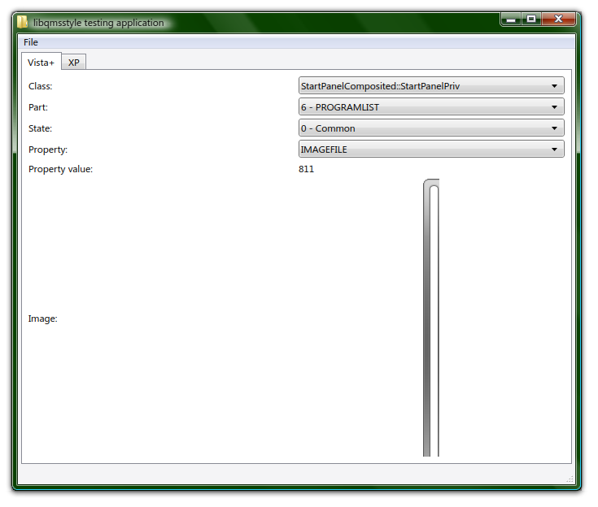

# libqmsstyle

## Microsoft® Windows™ is a registered trademark of Microsoft® Corporation. This name is used for referential use only, and does not aim to usurp copyrights from Microsoft. Microsoft Ⓒ 2025 All rights reserved. All resources belong to Microsoft Corporation.

## Introduction

libqmsstyle is a Qt C++ library tailor-made specifically for Windows Vista+ msstyles parsing (soon Windows XP). It is extremely unfinished and some stuff may not work as expected or function names might change in the near future.

At the time of writing this, libqmsstyle is being developed under Qt Creator, with Qt 6.10.0.

This library has [LibWres](https://github.com/The-Evil-Ass-Fountain-Openers/LibWres) as a dependency.

## Credits

- [msstyleEditor](https://github.com/nptr/msstyleEditor/) original code that helped out **a lot** with Vista+ MSSTYLE parsing

## Screenshots

## TODO

- [ ] Finish documentation
    - [ ] Vista+ msstyles
    - [ ] XP msstyles
- [X] Add support for reading and storing msstyles classes
- [X] Add support for getting the parts of an msstyles class
- [X] Add support for getting the states of an msstyles class part
- [ ] Make a singleton which will store every msstyles property for every class, part and state
- [X] Finish properties reading
- [ ] Add writing support
- [ ] Remove alpha premultiplication on IMAGEFILE properties loading
- [ ] Add AMAP reading support (Windows 8+)
- [ ] Convert the current testing app into an MSSTYLE previewer (partly done)
- [ ] Add screenshots
- [ ] Add Windows XP MSSTYLE parsing support
