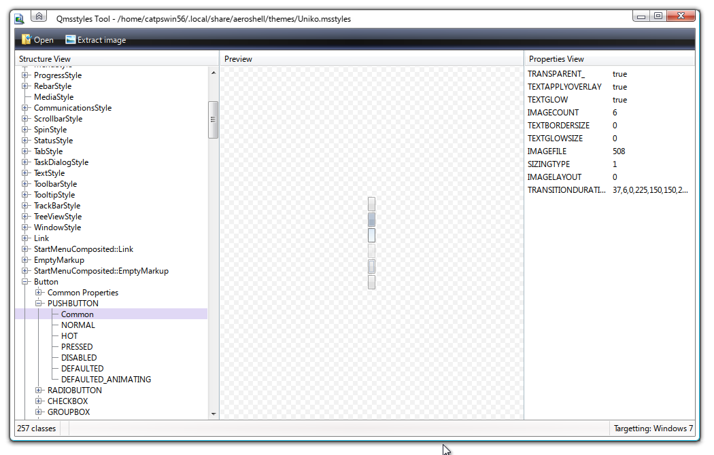
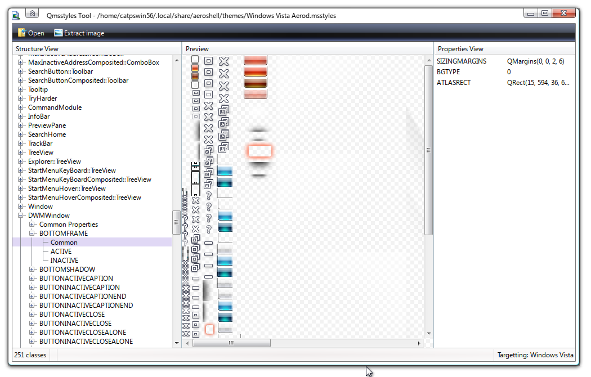

# libqmsstyles

## Microsoft® Windows™ is a registered trademark of Microsoft® Corporation. This name is used for referential use only, and does not aim to usurp copyrights from Microsoft. Microsoft Ⓒ 2026 All rights reserved. All resources belong to Microsoft Corporation.

## Introduction

libqmsstyles is a Qt C++ library tailor-made specifically for Windows Vista+ msstyles parsing (soon Windows XP). It is extremely unfinished and some stuff may not work as expected or function names might change in the near future.

This library has been tested in Qt 6.11.

## Credits

- [msstyleEditor](https://github.com/nptr/msstyleEditor/): for the documentation, visual maps and definitions.

## Installation

This library depends on [LibWres](https://github.com/The-Evil-Ass-Fountain-Openers/LibWres), so make sure to install it before installing LibQmsstyles.

1. Clone this repository with ``git clone --depth=1 https://github.com/The-Evil-Ass-Fountain-Openers/libqmsstyles.git``, or by downloading the source code directly from the ``Code`` button.
2. Within the repository folder, run ``bash install.sh`` in a terminal. You can also pass ``--build-tool`` to build the msstyles tool.

## Screenshots

## TODO

- [ ] Order classes list alphabetically
- [ ] Add AMAP reading support (Windows 8+)
- [ ] Add editing support
    
    This leads to:
    - [ ] Turn the msstyles previewer into an msstyles editor
- [ ] Add [binary compatibility](https://community.kde.org/Policies/Binary_Compatibility_Issues_With_C%2B%2B)
- [X] Make an msstyles previewer (``src/tool/``)
- [ ] Add a general controls preview to the msstyles previewer (will depend on [Borealis](https://github.com/aeroshell-desktop/borealis) for this)
- [X] Add better screenshots
- [ ] Detect more Windows versions
- [ ] Add Windows XP msstyles parsing support
